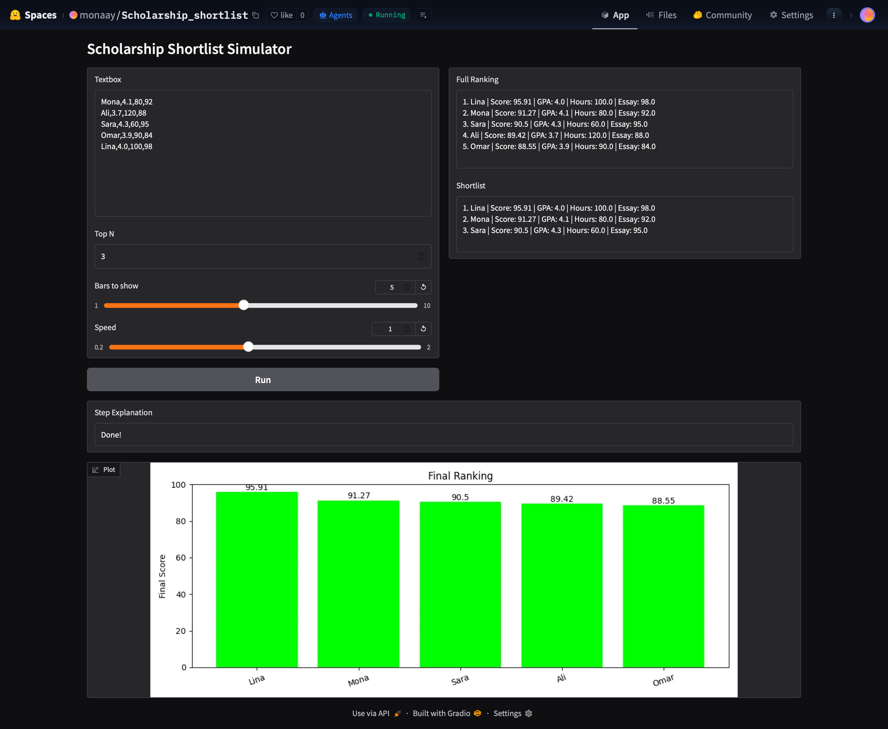
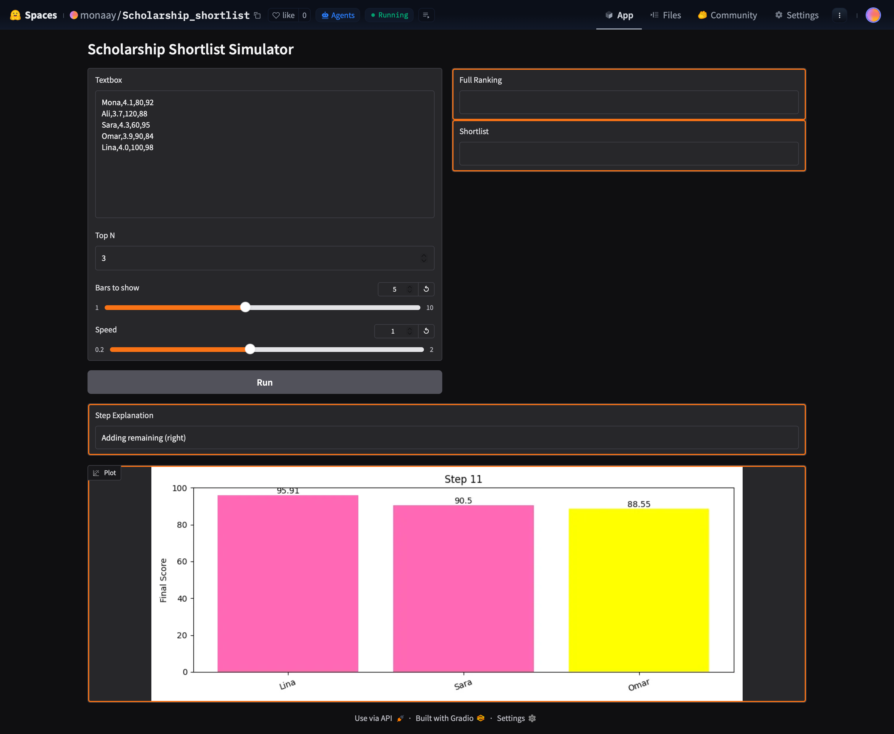
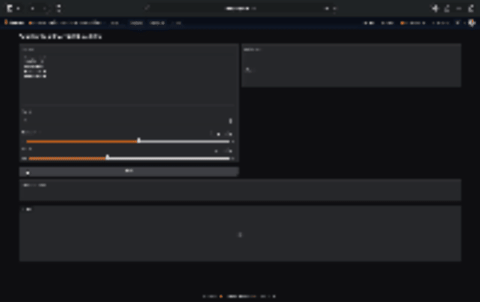
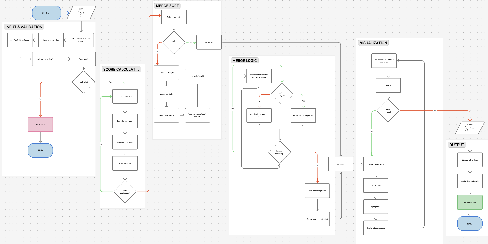
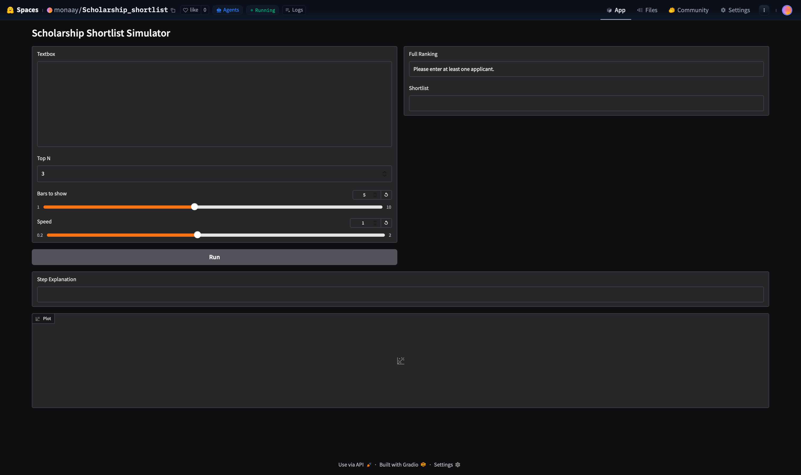
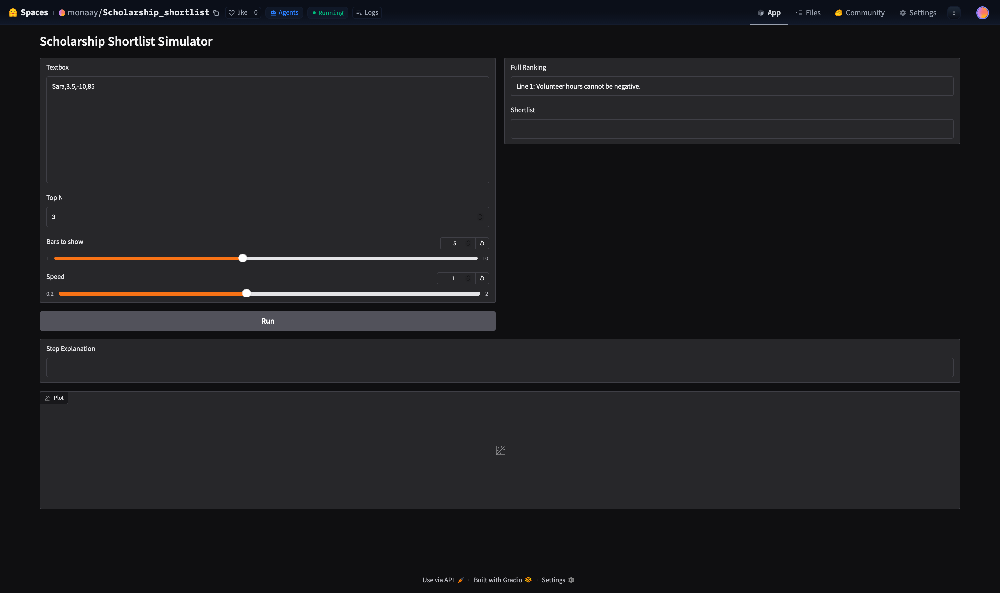

Check out the configuration reference at https://huggingface.co/docs/hub/spaces-config-reference


# Project Title
## Chosen Problem (1-2 sentences):
This project solves the Scholarship Shortlist problem where applicants are ranked based on a computed final score using GPA, volunteer hours, and essay score. The goal is to sort applicants and display the top candidates clearly while visually demonstrating how the ranking is formed.

## Chosen Algorithm (name + why it fits)
I chose Merge Sort because:

- It is efficient (O(n log n)) and works well for ranking datasets
- It naturally divides the data into smaller parts making it ideal for visual step-by-step explanation
- It ensures a stable and consistent ordering of applicants based on score

Merge Sort is especially suitable here because:

- The dataset (applicants) is structured
-We need a clear comparison-based ranking
-The recursive splitting and merging can be visualized effectively for learning purposes

## Demo (screenshot of run)
### Completed

### In action

### gif


## Problem Breakdown & Computational Thinking 


### Flowchart



### Decomposition:
The problem is broken into the following steps:

1. Take user input (applicant data, Top N, bars, speed)
2. Validate and parse input
3. Compte final score for each applicant
4. Store applicants in a list
5. Apply Merge Sort to rank applicants
6. Record sorting steps for visualization
7. Display results and animation

### Pattern Recognition:

Merge Sort follows a repeating pattern:

- Split list into halves
- Recursively sort each half
- Compare elements between halves
- Merge them back in sorted order

This repeated splitting and merging is the core pattern used to organize data efficiently.

### Abstraction:
To keep the simulation clear:

- Only final scores and names are visualized
- Internal recursion details are hidden
- Users only see the comparisons, placements and merging steps

Unnecessary low-level operations are not shown to avoid confusion. like what so implementation specific details like dictionary structure, loop conditions bouandries... among other things

### Algorithm Design (Input → Process → Output)
Input:

- Applicant data (Name, GPA, Hours, Essay)
- Top N value
- Number of bars to show
- Animation speed

Process:

- Parse and validate input
- Compute final score:
    - GPA → percentage
    - Volunteer hours capped at 100
    - Final Score = 50% GPA + 20% Hours + 30% Essay
- Apply Merge Sort
- Record each step for visualization

Output:

- Full sorted ranking
- Top N shortlist
- Step-by-step animation
- Final chart


## Testing 

1. Normal Case (Default Data)

Test 1 — Default applicants, sort by final score

- Input:
``` 
Mona,4.1,80,92  
Ali,3.7,120,88  
Sara,4.3,60,95  
Omar,3.9,90,84  
Lina,4.0,100,98  
```


- Expected:
    Applicants should be ranked from highest → lowest final score based on the weighted formula.
- Actual:
    The Merge Sort algorithm correctly split the list, compared scores, and merged results.
    The final ranking matched the expected descending order.

2. Edge Case — Empty Input

Test 2 — No applicants entered

- Input: (empty textbox)
- Expected:
    The program should display an error message and stop execution.
- Actual:
    The app returned:
    “Please enter at least one applicant.”
    No crash occurred.
3. Edge Case — Invalid Format

Test 3 — Missing values

- Input:
```
Mona,4.1,80

```
- Expected:
    The program should detect incorrect format and display an error.
- Actual:
    The app returned:
    “Line 1 must be: Name, GPA, Volunteer Hours, Essay Score”

4. Edge Case — Invalid GPA Value

Test 4 — GPA out of range

* Input:

```
Ali,5.0,50,90 
```
- Expected:
    GPA should be rejected (valid range: 0–4.3).
- Actual:
    The app returned:
    “GPA must be between 0 and 4.3.”

5. Edge Case — Negative Values

Test 5 — Negative volunteer hours

- Input:

```
Sara,3.5,-10,85
```
- Expected:
    Negative values should not be allowed.
- Actual:
    The app returned:
    “Volunteer hours cannot be negative.”

## Actual Edge Case Testing (Screenshots)
### Edge Case 1: Empty input


### Edge Case 2: Invalid Format


### Edge Case 3: Invalid Values


### Edge Case 4: Negative Values


## How to Run the project Online:
1. Open the Hugging Face Space link.
2. Enter applicant data in the input box (format: Name, GPA, Volunteer Hours, Essay Score).
3. Choose how many top applicants to display.
4. Adjust the number of bars and animation speed.
5. Click Run to start the simulation.
6. Watch the Merge Sort visualization and final ranked shortlist.


## Steps to Run (local) + requirements.txt
1. Clone repository 
```
git clone https://huggingface.co/spaces/monaay/Scholarship_shortlist
cd Scholarship_shortlist
```
2. Install dependencies:
```
pip install -r requirements.txt
```
3. Then run the app.py
```
python app.py
```
4. Lastly open the link shown in terminal 


## Hugging Face Link
https://huggingface.co/spaces/monaay/Scholarship_shortlist


## User interface
The app uses Gradio to provide a simple and interactive interface:

- Textbox for applicant input
- Number input for Top N
- Sliders for:
    - Bars shown
    - Animation speed
- Button to run simulation
- Live chart visualization using matplotlib
- Step-by-step explanation output

The interface is designed to be:

- Beginner-friendly
- Clear and minimal
- Easy to interact with

## Score calculation
This is what I saw fit as a balanced evaluation system GPA having the highest weighing
- GPA is converted to percentage
- Volunteer hours are capped at 100

## Author & Acknowledgment (sources + AI use, if any)
Author: Mona A

AI Usage: None

All algorithm implementation and logic were:

- Written manually using the help of the sources and tools below
- Understood and verified
- Adjusted to match assignment requirements
- figma was used to draw flow chart
No ai generated code, but code was based on sources reddit youtube and the lecture slides heavily influenced code

Sources:
- CISC 121 Lecture Slides
- https://www.geeksforgeeks.org/dsa/merge-sort/
- https://matplotlib.org/stable/api/_as_gen/matplotlib.pyplot.bar.html
- https://www.gradio.app/
- https://youtu.be/X4R1KIjcCQk?si=1xXLDD1WYsYP2ice
- https://www.reddit.com/r/algorithms/comments/1p83hn4/interactive_algorithm_visualizer_see_merge_sorts/?utm_source=share&utm_medium=web3x&utm_name=web3xcss&utm_term=1&utm_content=share_button
- https://www.reddit.com/r/learnpython/comments/1id6m8m/i_am_trying_to_install_gradio_i_created_a_py_file/?utm_source=share&utm_medium=web3x&utm_name=web3xcss&utm_term=1&utm_content=share_button
- Figma 
